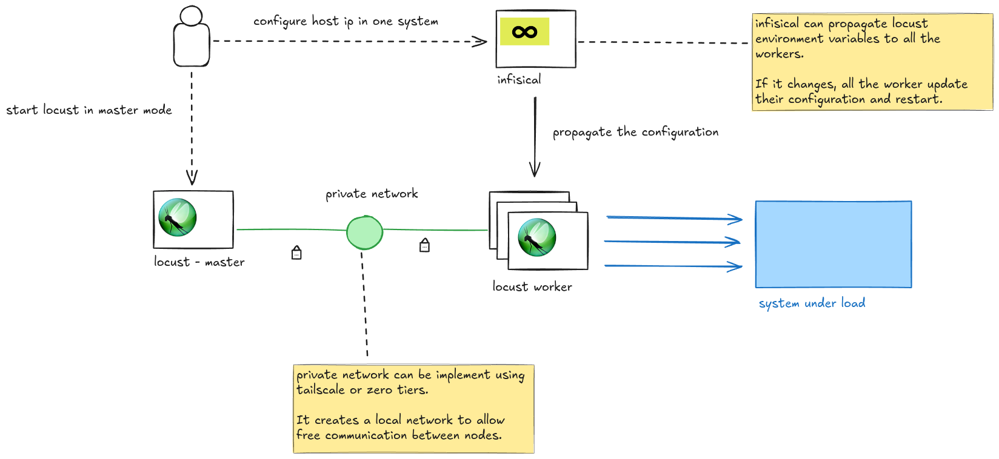

# Locust Load Testing Cluster

A scalable, distributed load testing infrastructure using Locust workers that can be easily deployed and managed in a single-user context. This setup allows you to create a farm of dedicated servers for load testing that can scale horizontally.



## Overview

This configuration implements a distributed load testing cluster where:
- Multiple Locust worker nodes connect to a master node
- Workers are deployed in a private network for security
- Configuration is centrally managed through Infisical
- Workers automatically discover and connect to the master node
- The system can be easily scaled by adding more worker instances

## Architecture

The system consists of:

1. **Master Node**: Runs Locust in master mode, coordinates test execution
2. **Worker Nodes**: Run Locust workers that execute the actual load tests
3. **Private Network**: Secure communication between nodes (Tailscale/ZeroTier)
4. **Infisical**: Configuration management and secret distribution
5. **Target System**: The application/service being load tested

### How it works

1. A developer configures their host IP in Infisical as the master node
2. Infisical propagates the master IP and other configuration to all workers
3. Workers automatically connect to the master node through the private network
4. The master coordinates load test execution across all connected workers
5. Results are aggregated and displayed on the master's web interface

## Components

- **[Locust](https://locust.io/)**: Open-source load testing framework
- **Ubuntu + systemd + pipx**: Base system with service management and Python package isolation
- **[Infisical](https://infisical.com/)**: Secrets and configuration management
- **Private Network**: Secure communication layer (tested with Tailscale and ZeroTier)

## Prerequisites

### Master Node Setup

1. **Private Network Access**: Join your private network (Tailscale/ZeroTier)
2. **Infisical Project Access**: Must have access to the Infisical project to set your IP as master
3. **Locust Installation**: Install Locust on your development machine
4. **Test Scripts**: Prepare your Locust test files

### Worker Node Requirements

- Ubuntu-based system (tested on Ubuntu)
- Internet access for package installation
- Access to the same private network as the master
- Infisical CLI access

## Installation

### Worker Node Setup

Run the installation script on each worker node:

```bash
https://github.com/FabienArcellier/locust-cluster-worker-node.git
cd locust-cluster-worker-node
bash install.sh
```

This script will:
1. Install Infisical CLI
2. Configure Infisical authentication
3. Install the Locust worker service
4. Enable and start the worker service

### What the install script does

1. **Installs Infisical CLI**:
   ```bash
   curl -1sLf 'https://artifacts-cli.infisical.com/setup.deb.sh' | sudo -E bash
   sudo apt-get update && sudo apt-get install -y infisical
   ```

2. **Configures Infisical**:
   ```bash
   infisical login
   infisical init
   ```

3. **Sets up systemd service**:
   - Copies `locust_worker.service` to `/etc/systemd/system/`
   - Enables auto-start on boot
   - Starts the worker service immediately

## Usage

### For Developers (Master Node)

1. **Join the Private Network**: Ensure you're connected to the same private network as the workers

2. **Configure Master IP in Infisical**: 
   - Access your Infisical project
   - Set your private network IP as the master node IP
   - Workers will automatically detect this change and connect

3. **Start Locust Master**:
   ```bash
   locust -f your_test_file.py --master
   ```

4. **Access Web Interface**: 
   - Open `http://YOUR_PRIVATE_IP:8089` in your browser
   - Configure your test parameters
   - Start the load test

### Worker Node Management

Workers run as systemd services and will:
- Automatically start on boot
- Restart if they crash
- Watch for configuration changes in Infisical
- Reconnect to the master if the IP changes

**Service Commands**:
```bash
# Check worker status
sudo systemctl status locust_worker

# View worker logs
sudo journalctl -u locust_worker -f

# Restart worker
sudo systemctl restart locust_worker

# Stop worker
sudo systemctl stop locust_worker
```

## Configuration

### Infisical Environment Variables

The workers expect these environment variables in Infisical:
- Master node IP address
- Any test-specific configuration
- Authentication credentials if needed

### Systemd Service Configuration

The worker service (`locust_worker.service`) is configured with:
- **Auto-restart**: Service restarts automatically if it fails
- **Rate limiting**: Maximum 30 restarts in 30 minutes
- **Configuration watching**: Automatically reloads when Infisical config changes
- **Working directory**: `/home/ubuntu`

## Scaling

To scale your load testing cluster:

1. **Add more workers**: Deploy the installation script on additional nodes
2. **Join private network**: Ensure new workers can reach the master
3. **Infisical access**: Grant access to the Infisical project
4. **Auto-discovery**: Workers will automatically connect to the master

## Troubleshooting

### Common Issues

**Worker not connecting to master**:
- Check private network connectivity: `ping MASTER_IP`
- Verify Infisical configuration: `infisical secrets`
- Check worker logs: `sudo journalctl -u locust_worker -f`

**Service not starting**:
- Check systemd status: `sudo systemctl status locust_worker`
- Verify Infisical authentication: `infisical login`
- Check file permissions and paths

**Configuration not updating**:
- Restart worker service: `sudo systemctl restart locust_worker`
- Check Infisical project access
- Verify environment variables in Infisical

### Logs and Monitoring

- **Worker logs**: `sudo journalctl -u locust_worker -f`
- **System logs**: `sudo journalctl -xe`
- **Service status**: `sudo systemctl status locust_worker`

## Security Considerations

- All communication occurs within the private network
- Infisical manages secrets securely
- Workers only have access to necessary configuration
- No direct internet exposure of load testing infrastructure

## License

See [LICENSE](LICENSE) file for details.
